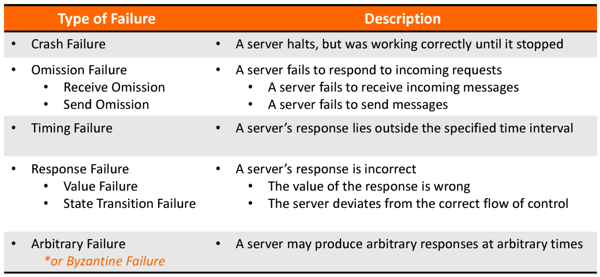
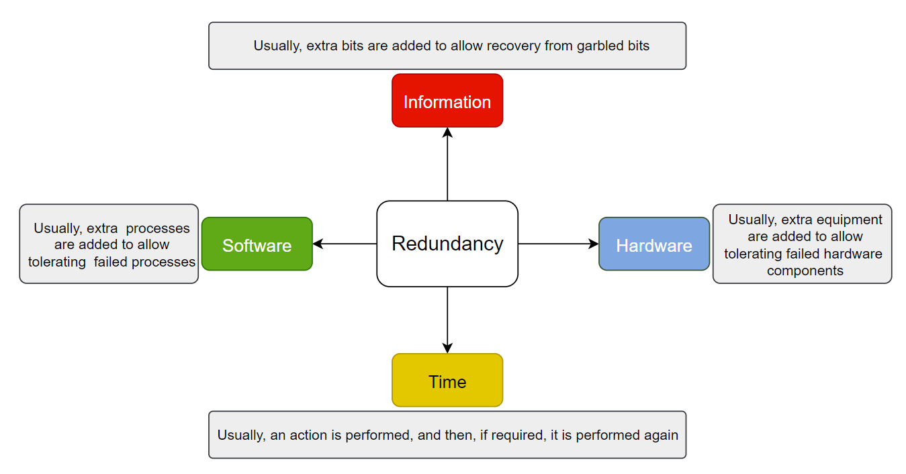
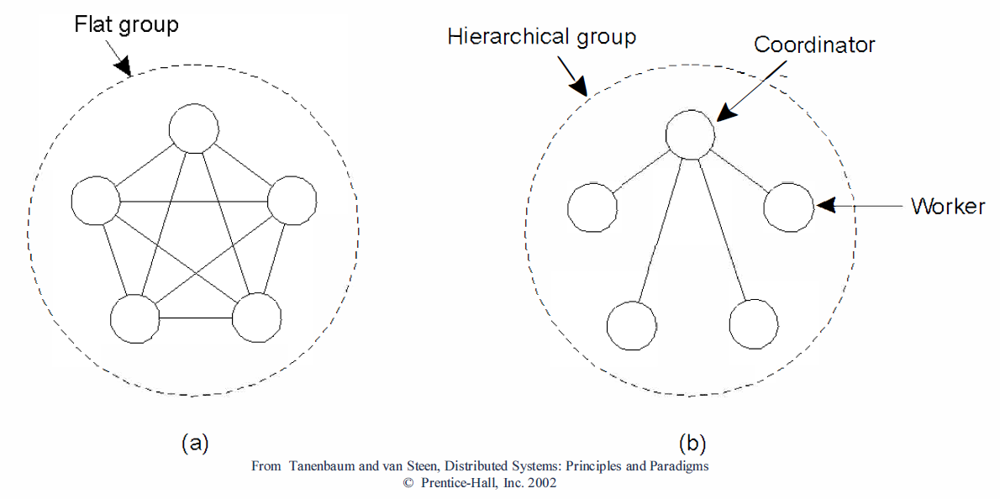

## Replication
- It is the process of maintaining the data at multiple computers.
- **Necessary for**
  1. Improving performance
  2. Increasing the availability of services
  3. Enhancing the scalability of systems
  4. Securing against malicious attacks
- **Key issue**: if there are many replicas of the same thing, how do we keep all of them up-todate? How do we maintain *consistency* of replicated data? 

## Consistency Models
1. **Data-Centric Consistency Models**
  - Continuous
  - Sequential
  - Causal
2. **Client-Centric Consistency Models**
  - Monotonic Reads
  - Monotonoc Writes
  - Read Your Writes
  - Write Follow Reads

### Data-store (Optional)

  {: .align-center}{: width="500" }

*The general organization of a logical data store, physically distributed and replicated across multiple processes.*
{: style="color:gray; font-size: 80%; text-align: center;"}

- A data store is a service that stores data, E.g., databases, file systems, web servers
- Consists of multiple servers each containing a copy of all the data items stored in the data store
- Can be read from or written to by any process in a DS.
- Reads are performed locally
- Writes are performed locally first and then propagated to remote replicas 

### 1. **Data-Centric Consistency Models**

#### a. **<u>Continuous Consistency</u>**

- Applications can specify tolerable inconsistencies. Three axes of inconsistencies:

  1. Numerical value deviation between replicas.
  2. Staleness deviation between replicas.
  3. Update operation ordering deviation.
- These are termed as "continuous consistency ranges."

#### b. **<u>Sequential Consistency</u>**

  {: .align-center}{: width="700" }

*(a) A sequentially consistent data store. (b) A data store that is not sequentially consistent.*
{: style="color:gray; font-size: 80%; text-align: center;"}

- A weaker consistency model, which represents a relaxation of the rules.
- It is also much easier (possible) to implement.
- All clients see all (write) operations performed in the same order:
  - Assumes all operations are executed in some sequential order
  - Program order is maintained (i.e., the order of writes as performed by a single process must be maintained)
  - All processes see the same ordering of operations 

#### c. **<u>Causal Consistency</u>**

  {: .align-center}{: width="600" }

*This sequence is allowed with a causally-consistent store, but not with a sequentially consistent store.*
{: style="color:gray; font-size: 80%; text-align: center;"}

  {: .align-center}{: width="700" }

*(a) A violation of a causally-consistent store. (b) A correct sequence of events in a causally-consistent store.*
{: style="color:gray; font-size: 80%; text-align: center;"}

- Weaker than sequential consistency
- Two operations are causally related if:
  - A read is followed by a write in the same client
  - A write of a data item is followed by a read of that data item in any client
- Writes that are potentially causally related must be seen by all processes in the same order.
- Concurrent writes may be seen in a different order on different machines (i.e., by different processes as long as program order is respected). 

### 2. **Client-Centric Consistency Models**

- Client-centric consistency provides guarantees for a single client for its accesses to a data-store

  {: .align-center}{: width="700" }

*The read operations performed by a single process P at two different local copies of the same data store. (a) A monotonic-read consistent data store. (b) A data store that does not provide monotonic reads.*
{: style="color:gray; font-size: 80%; text-align: center;"}

#### a. **<u>Monotonic reads</u>**: 
- If a process reads the value of a data item x, any successive read operation on x by that process will always return that same value or a more recent value.

  {: .align-center}{: width="700" }

*The write operations performed by a single process P at two different local copies of the same data store. (a) A monotonic-write consistent data store. (b) A data store that does not provide monotonic-write consistency.*
{: style="color:gray; font-size: 80%; text-align: center;"}

#### b. **<u>Monotonic writes</u>**: 
- A write operation by a process on a data item x is completed before any successive write operation on x by the same process. 

  {: .align-center}{: width="700" }

*(a) A data store that provides read-your-writes consistency. (b) A data store that does not.*
{: style="color:gray; font-size: 80%; text-align: center;"}

#### c. **<u>Read your writes</u>**: 
- The effect of a write operation by a process on data item x will always be seen by a successive read operation on x by the same process.

  {: .align-center}{: width="700" }

*(a) A writes-follow-reads consistent data store. (b) A data store that does not provide writes-follow-reads consistency.*
{: style="color:gray; font-size: 80%; text-align: center;"}

#### d. **<u>Writes follow reads</u>**: 
- A write operation by a process on a data item x following a previous read operation on x by the same process is guaranteed to take place on the same or more recent value of x that was read.

## Reliability and Fault Tolerance

### Dependibility

- Fault-tolerance is related to dependability, which covers:
  1. **Availability**: Readiness for usage
  2. **Reliability**: Continuity of service delivery
  3. **Safety**: Very low probability of catastrophes
  4. **Maintainability**: How easy a failed system may be repaired.

### Basic Terminologies

- **Failure**: When a component is not living up to its specifications, a failure occurs.
- **Error**: That part of a component’s state that can lead to a failure.
- **Fault**: The cause of an error.

**Fault** --- causes ---> **Error**--- results in ---> **Failure**

### Different Fault Management Techniques:

- **Fault prevention**: Prevent the occurrence of a fault.
- **Fault tolerance**: Build a component in such a way that it can meet its specifications in the presence of faults (i.e., mask the presence of faults).
- **Fault removal**: Reduce the presence, number, and seriousness of faults.
- **Fault forecasting**: Estimate the present number, future incidence, and the consequences of faults.

### Failure Models/Types of Failures
 

{: .align-center}{: width="800"}

 

#### Mask Failures By Redundancy

{: .align-center}{: width="900"}

*The key technique for masking faults is to use redundancy*
{: style="color:gray; font-size: 80%; text-align: center;"}

**<u>Hardware Redundancy</u>**
- Two computers are employed for a single application, one acting as a standby
  - Very costly, but often very effective solution
- Redundancy can be planned at a finer grain
  - Individual servers can be replicated
  - Redundant hardware can be used for non-critical activities when no faults are present
  - Redundant routes in network

**<u>Process Redundancy</u>**

- Process groups:
  - All members of a group receive a message sent to the group.
  - If one process fails, others can take over.
  - Can be dynamic; processes can have multiple memberships.

{: .align-center}{: width="600"}

*Flat versus hierarchical groups*
{: style="color:gray; font-size: 80%; text-align: center;"}

### CAP Theorem

- The CAP theorem states "*A system can be either strongly consistent (C) or available (A) during a network partition (P)*".

- **Consistency (C)**: A shared and replicated data item appears as a single, up-to-date copy.
- **Availability (A)**: Updates will always be eventually executed.
- **Partition-tolerance (P)**: The system is tolerant to the partitioning of a process group (e.g., because of a failing network).

### Consensus - Concept

- Reaching Agreement is a fundamental problem in distributed computing, e.g, mutual exclusion, leader election, totally ordered multicast, ATC system, Spaceship engine control (proceed or abort)
- There are three requirements: 
  1. <u>Agreement</u>: every process must output the same value 
  2. <u>Validity</u>: every value output must have been provided as the input for some process 
  3. <u>Termination</u>: eventually, every process must output a value.

#### Variants of Consensus Problem

- **Consensus Problem (C)**
  - Each process proposes a value
  - All processes agree on a single value

- **Byzantine Generals Problem (BG)**
  - Process fails arbitrarily, byzantine failure
  - Still processes need to agree

- **Interactive Consistency (IC)**
  - Each process propose its value
  - All processes agree on the vector

### Failure Detection

- Each process is equipped with a failure detection module.
- A process P probes another process Q for a reaction.
- If Q reacts: Q is considered to be alive (by P).
- If Q does not react within t time units: Q is suspected to have crashed.
- Observation for a synchronous system:
  - A suspected crash => a known crash

### Reliable Client-Server Communication
- A communication channel may exhibit crash, omission, timing, and arbitrary failures. 
- Pont-to-point communication:  
  - TCP can mask omission failure, but not crash failure, where the connection is broken.  
  - One way to deal with it is to generate an exception, or automatically setup a new connection 

- **RPC (Remote Procedure Calls) semantics (behavior) in the presence of failure:** 
  - The client is unable to locate the server.
  - The request message from the client to the server is lost.
  - The server crashes after receiving a request.
  - The reply message from the server to the client is lost.
  - The client crashes after sending a request.
  - Two "easy" solutions:
    1. If unable to locate the server: just report back to the client.
    2. If the request was lost: just resend the message.

- **RPC semantics: Server Crash**
  - Server crashes have different semantics: 
    - <u>at least once:</u> server guarantees that the RPC has been carried out at least once
    - <u>at most once:</u> server guarantees that the RPC has been carried out at most one time  
    - <u>guarantee nothing:</u> RPC may have been carried out anywhere from zero to a large number of times.
    - <u>exactly once:</u> executed only one time, ensuring that there are no duplicates and no lost calls (impossible to achieve)

### Checkpoint and Message Logging

#### Checkpoint
- Checkpoint: Each process saves its state time to time to a local stable storage
- Independent Checkpoint: Each process independently takes snapshot
- Coordinated Checkpoint: Each process takes a checkpoint after a globally coordinated action

#### Message Logging

Instead of taking an (expensive) checkpoint, try to replay your (communication) behavior from the most recent checkpoint

  - store messages in a log ⇒  replay your (communication) behavior from the most recent checkpoint 

- Assumption: Assume *a piecewise deterministic execution model*: 
  - The execution of each process can be considered as a sequence of state intervals 
  - Each state interval starts with a nondeterministic event (e.g., message receipt)  
  - Execution in a state interval is deterministic 

By logging non-deterministic events for later replay, a deterministic execution model is established, facilitating recovery from failures.
