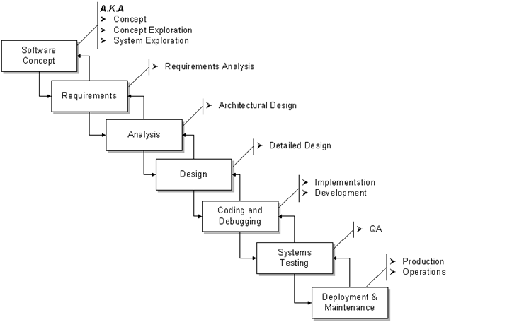
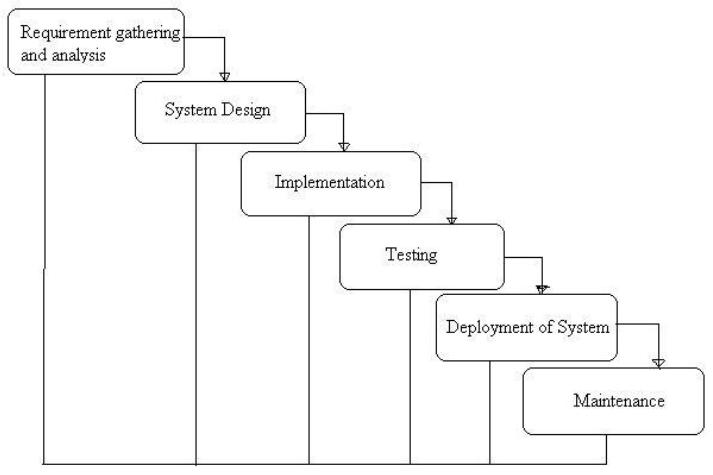
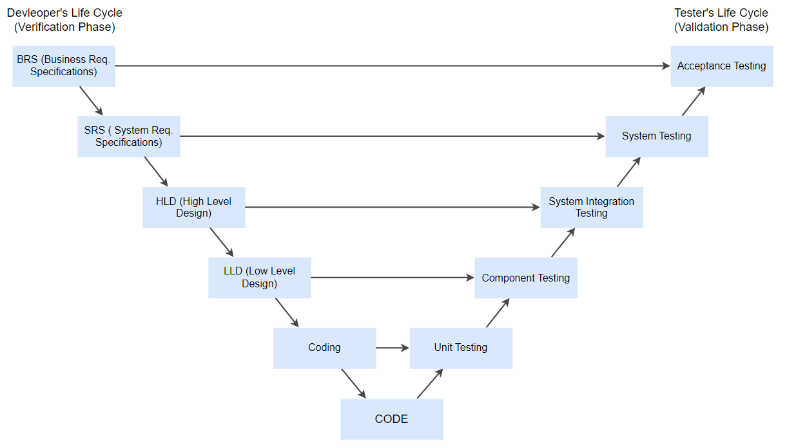

## Why Software Engineering?

- **Need for Software Engineering:**

    - **Large Software**: Engineering methods needed for managing large-scale software.
  
    - **Scalability**: Engineering principles essential for easily expanding existing software.
  
    - **Cost**: Hardware costs are decreasing, but software remains expensive without proper processes.
  
    - **Dynamic Nature**: Software needs to adapt to changing user needs; engineering helps in this.
  
    - **Quality Management**: Better development processes lead to higher-quality software.

## Terminologies to know before reading about SDLC (Optional)

### [Terminologies and Abbreviation](){:target="_blank"}

### Project Phases

  {: .align-center}{: width=auto }

*Project Phases*
{: style="color:gray; font-size: 80%; text-align: center;"}

- **Concept**: "Why" phase
  - not a mandatory
  - collects ideas, project justification, initial planning & estimates
- **Requirements**: "What" phase
  - inputs SOW, proposal
  - outputs
    - Requirements Document (RD) a.k.a.Requirements Specification Document (RSD), Software Requirements Specification (SRS)
    - 1st Project Baseline
    - Software Project Management Plan (SPMP)
  - 2 types
    - functional: features & capabilities
    - Non-functional: technical (everything else)
  - Ends with SRR
 - **Analysis & Design**: "How" phase 
    - Top-level design & detailed design
    - Inputs requirement documents
    - Outputs:
      - Functional Specification 
      - Detailed Design Document 
      - User Interface Specification 
      - Data Model
      - Prototype (can also be done with requirements)
      - Updated Plan (improved estimates; new baseline)
    - Ends with CDR
  - **Developement**: "Do It" phase
    - Coding & unit testing
  - **Integration & Test**: Evolves from developement phase
    - Integration --> programmer's task, Test --> QA team's task
    - Starts with integration of modules
    - initial incomplete version is constructed
    - progressively more components are added
    - 3 integration testing strategies:
      - 1. **Big Bang**: Integrates all modules to build full system. High-risk, needs good documentation.
      - 2. **Bottom-Up**: Tests low-level components first, then high-level. Efficient in error detection.
      - 3. **Top-Down**: Tests top modules first, then subsystems. Good for detecting lost links.
    - Tests: 
      - Integration testing
      - Black & White-box testing
      - Load & Stress testing
      - Alpha & Beta testing
      - Acceptance testing
  - **Deployment & Maintenance**:
      - Deployment --> delivering the product to the customer and take feedback
      - Maintenance --> fix defects, add features, improve performance
        - Configuration control is important
        

## Sofware Life Cycle Models (SDLC)

1. Build & Fix Model
2. Waterfall Model
3. V Model
4. Prototype Model
5. Incremental Model
6. Iterative Model
7. Spiral Model
8. Evolutionary Process Model
9. Agile Model

### Build & Fix Model
- Product is constructed without specifications or any attempt at design
- Adhoc approach and not well defined
- Simple two-phase model
- Suitable for small programming exercises of 100 or 200 lines.
- Unsatisfactory for software for any reasonable size
- Code soon becomes unfixable
- No room for structured design
- Maintenance is practically not possible

### Waterfall Model

- Also known as '*Linear Sequential Model*' or '*Classic Life Cycle Model*'.
- Each phase completed before next starts.
- Used for small projects.
- Feedback after each phase for course correction.
- Testing starts after development is complete.

{: .align-center}{: width="600"}

*Waterfall Model - Phases*
{: style="color:gray; font-size: 80%; text-align: center;"}

- **Advantages**
  - Clear project structure and phases.
  - Easy to manage due to its rigidity.
  - Defined stages and deliverables.
  - Suitable for projects with clear requirements.

- **Disadvantages**
  - Not flexible; difficult to go back to previous stages.
  - Not ideal for complex and object-oriented projects.
  - Assumes requirements are known upfront.
  - Lengthy project durations due to sequential phases.

- **When to use**
  - When requirements are clear and fixed.
  - For short projects with a clear scope.
  - When there's a clear understanding of the technology being used.
  - In projects where the client has a clear vision and doesn't anticipate changes.

### V Model

- Stands for Verification and Validation.
- Sequential like Waterfall, each phase completed before next.
- Testing planned parallel to development.

{: .align-center}{: width="900"}

*V-Model - Phases*
{: style="color:gray; font-size: 80%; text-align: center;"}

- **Advantages**: 
  - Simple, easy to use.
  - Early test planning, saves time.
  - Proactive defect tracking.
  - Good for small projects with clear requirements.

- **Disadvantages**: 
  - Rigid, least flexible.
  - No early prototypes.
  - Changes require document updates.

- **When to Use**: 
  - Small to medium projects with fixed, clear requirements.
  - Ample technical resources and expertise available.

### Prototype Model

- Built to understand requirements, not a complete system.
- Gives client an "actual feel" of the system.
- Ideal for complex, large systems with unclear requirements.

- **Advantages**: 
  - Active user involvement.
  - Early error detection.
  - Quick user feedback.
  - Easy identification of missing or confusing functions.

- **Disadvantages**: 
  - Leads to "implement and repair" approach.
  - May increase system complexity.
  - Risk of incomplete application.
  - Inadequate problem analysis.

- **When to Use**: 
  - High user interaction, like online systems and web interfaces.
  - Best for systems requiring minimal end-user training.
  - Good for designing human-computer interface systems.

### Incremental Model

- Divides requirements into builds, follows a "multi-waterfall" cycle.
- Each module goes through requirements, design, implementation, and testing.
- Working software produced early, functionality added incrementally.

- **Advantages**: 
  - Quick, early working software.
  - Flexible, easier to change scope.
  - Easier to test and debug in small iterations.
  - Customer can respond to each build.
  - Low initial delivery cost.
  - Easier risk management.

- **Disadvantages**: 
  - Requires good planning and design.
  - Needs complete system definition before incremental build.
  - Total cost higher than waterfall.

- **When to Use**: 
  - Clear, well-understood requirements.
  - Need for early market entry.
  - Using new technology.
  - Limited skilled resources.
  - High-risk features and goals.

### Spiral Model

- Similar to Incremental, focuses on risk analysis.
- Four phases: Planning, Risk Analysis, Engineering, Evaluation.
- Repeats these phases in iterations called Spirals.

- **Phases**: 
  - **Planning**: Gather requirements like BRS and SRS.
  - **Risk Analysis**: Identify risks, suggest alternate solutions, produce prototype.
  - **Engineering**: Software development and testing.
  - **Evaluation**: Customer evaluates project output.

- **Advantages**: 
  - High focus on risk analysis.
  - Good for large, mission-critical projects.
  - Strong documentation control.
  - Early software production.
  - Allows adding functionality later.

- **Disadvantages**: 
  - Costly to use.
  - Requires risk analysis expertise.
  - Success dependent on risk analysis.
  - Not suitable for small projects.

- **When to Use**: 
  - Important cost and risk evaluation.
  - Medium to high-risk projects.
  - Unclear user needs or complex requirements.
  - Expecting significant changes.

### Iterative Model

- Starts with partial requirements, develops part of the software, then reviews to identify more requirements.
- Repeats process until complete product is developed.

- **Advantages**: 
  - Allows high-level design before full build.
  - Early defect tracking.
  - Reliable user feedback.
  - More time for designing, less for documenting.

- **Disadvantages**: 
  - Each iteration phase is rigid, no overlaps.
  - Costly issues may arise due to incomplete upfront requirements.

- **When to Use**: 
  - Clear, well-understood requirements.
  - Large-scale projects.
  - Major requirements defined, but some details can evolve.

### Evolutionary Process Model

- Combines iterative and incremental approaches.
- Phases similar to waterfall but cyclical.
- Requirements, plans, and solutions evolve over time.
- "Design a little, build a little, test a little, deploy a little."
- Develop core part first, then incremental features.
- Collect customer feedback and modify requirements.

- **Advantages**: 
  - Better risk analysis.
  - Adapts to changing environment.
  - Quick initial operation.
  - Good for large, mission-critical projects.
  - Early software production for customer feedback.

- **Disadvantages**: 
  - Ad hoc design possible.
  - Management complexity.
  - Requires skilled resources for risk analysis.
  - Not for small projects.
  - Can be costly.

- **When to Use**: 
  - New, not well-understood technology.
  - Complex projects with unstable requirements.
  - Large projects.
  - Object-oriented development.
  - Client prefers incremental delivery.

### Agile Model

- A type of Incremental model with rapid, small, incremental releases.
- Known for Extreme Programming (XP) among other Agile methodologies.

- **Advantages**: 
  - Rapid, continuous delivery for customer satisfaction.
  - Emphasizes people and interactions over process and tools.
  - Frequent delivery of working software.
  - Face-to-face communication prioritized.
  - Close cooperation between business and developers.
  - Focus on technical excellence and good design.
  - Adapts to changing circumstances.
  - Welcomes late changes in requirements.

- **Disadvantages**: 
  - Difficult to assess effort for large projects upfront.
  - Lack of emphasis on design and documentation.
  - Risk of project derailment if customer is unclear.
  - Not suitable for inexperienced programmers.

- **When to Use**: 
  - When frequent changes are expected.
  - Limited initial planning is acceptable.
  - Dynamic business and IT environment.
  - Provides flexibility to both developers and stakeholders.

### Comparison Table

| Model        | Key Feature           | Best For                | Flexibility | Risk Focus | Early Software | Advantages      | Disadvantages     |
|--------------|-----------------------|-------------------------|-------------|------------|----------------|-----------------|-------------------|
| Build & Fix   | No specs, ad-hoc      | Small tasks             | High        | No         | Immediate      | Quick start     | No maintainability|
| Waterfall     | Sequential phases     | Small, clear scope      | Low         | No         | Late           | Easy to manage  | Rigid             |
| V Model       | Parallel testing      | Small-medium, clear scope| Low        | No         | Late           | Early test planning | No early prototypes |
| Prototype     | Early 'feel' of system| Unclear requirements    | High        | No         | Early          | Quick feedback  | Incomplete apps   |
| Incremental   | Multi-waterfall, builds| Well-defined, new tech | Medium     | No         | Early          | Low initial cost| Higher total cost |
| Iterative     | Partial requirements, reviews| Large, evolving details| Medium  | No         | Early          | User feedback   | Costly issues     |
| Spiral        | Risk analysis         | Large, unclear scope    | High        | Yes        | Early          | Risk management | Costly            |
| Evolutionary  | Iterative + Incremental| Large, new tech        | High        | Yes        | Early          | Adapts to change| Management complexity|
| Agile         | Rapid cycles          | Changing requirements   | High        | No         | Early          | High flexibility| Not for newbies   |

## Functional requirements/Non-functional requirements

### Functional Requirements

- **Definition**: Requirements specified by the end user for basic functionalities.
- **What It Does**: Specifies what the system should do.
- **Who Specifies**: End user.
- **Mandatory**: Yes.
- Captured in use case
- **Testing**: Functional Testing (System, Integration, API, etc.)
- **Examples**: 
  1. User authentication.
  2. System shutdown in case of cyber-attack.
  3. Verification email upon registration.
  
- **Advantages**:
  - Helps in defining the system's functionality.
  - Easier to identify missing requirements.
  - Cheaper to fix errors at this stage.
  - Supports user goals and tasks.

---

### Non-Functional Requirements

- **Definition**: Quality attributes the system must satisfy.
- **What It Does**: Places constraints on how the system should fulfill functional requirements.
- **Who Specifies**: Technical people (Architects, Developers).
- **Mandatory**: No.
- Captured In quality attributes.
- **Testing**: Non-Functional Testing (Performance, Stress, Usability, Security, etc.)
- **Examples**: 
  1. Email latency no greater than 12 hours.
  2. Request processing within 10 seconds.
  3. Site should load in 3 seconds for >10,000 users.

- **Advantages**:
  - Ensures legal and compliance rules are followed.
  - Ensures reliability, performance, and user experience.
  - Helps in formulating security policy.

- **Disadvantages**:
  - Affects high-level software subsystems.
  - Requires special consideration, increasing costs.
  - Difficult to modify after architecture phase.

